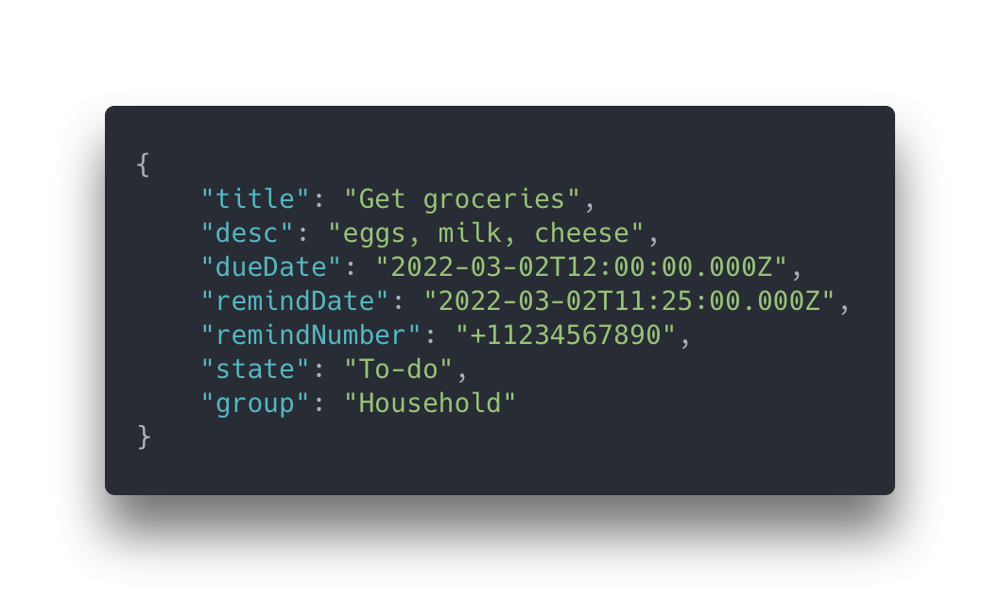

<!-- PROJECT LOGO -->
<br />
<div align="center">
  <a href="#">
    
  </a>

  <h3 align="center">Planii</h3>

  <p align="center">
    Nerd-ify your Kanban needs with a REST API
  </p>
</div>

<!-- ABOUT THE PROJECT -->

<div align="center">
  

  <br />

A way to plan and organize tasks, to-dos, and whatever else. An expressive API that can be consumed by any frontend visualization.

</div>

### Built With

- NodeJS
- Express
- MongoDB
- Jest
- Twilio
- Swagger (in-progress)
- Docker (in-progress)

## Getting Started

To get a local copy up and running follow these steps:

### Installation

1. Create a Twilio account and outgoing number at [https://twilio.com](https://twilio.com)
2. Clone the repo
   ```sh
   git clone https://github.com/kyler-swanson/planii.git
   ```
3. Install NPM packages
   ```sh
   npm install
   ```
4. Create a `.env`
   ```sh
   cp .env.example .env
   ```
5. Enter your Twilio keys in `.env`
   ```env
    TWILIO_SID = 'ACXXXXXXXXXXXXXXXXXXXXXXXXXXXXXXXX'
    TWILIO_TOKEN = 'your_auth_token'
    TWILIO_NUM = '+12345678901'
   ```
6. Start the project
   ```sh
   npm run dev
   ```

<!-- USAGE EXAMPLES -->

## Endpoints

Here, a "Thing" is a task or something to be completed.

- List Things
  - **[GET] `/api/thing`**
  - Query Params:
    - sort, string (`dueDate`, `state`, etc.)
    - order, string (`asc` or `desc`)
    - group, string (`group`, `state`, `dueDate`, etc.)
  - Example: `/api/thing?sort=dueDate&order=asc`
- Get Thing
  - **[GET] `/api/thing/{thing_id}`**
  - Example: `/api/thing/621e47f6f8ee1fc524b3295a`
- Create Thing
  - **[POST] `/api/thing`**
  - Body (`application/json`):
    - ```json
      {
        "title": "Get groceries",
        "desc": "eggs, milk, cheese",
        "dueDate": "2022-03-02T12:00:00.000Z",
        "remindDate": "2022-03-01T11:25:00.000Z",
        "remindNumber": "+11234567890",
        "state": "To-do",
        "group": "Household"
      }
      ```
- Update Thing
  - **[PATCH] `/api/thing/{thing_id}`**
  - Body (`application/json`):
    - ```json
      {
        "state": "In progress"
      }
      ```
- Delete Thing
  - **[DELETE] `/api/thing/{thing_id}`**

## Testing

In each controller (ex. `app/controllers/Thing`), there exists a [controller].spec.js file. This project uses Jest and Supertest to perform a basic suite of integration tests.

You may also run these tests yourself!

Simply run,

```sh
npm run test
```

You will also notice a `coverage` directory that is generated post-test. This folder contains a test report and coverage analysis. You can open a generated web report at `coverage/lcov-report/index.html`.
